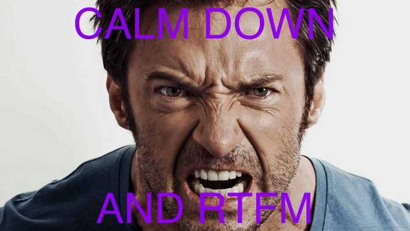
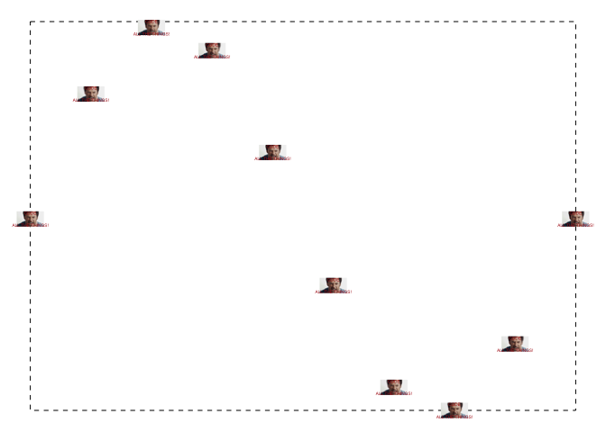
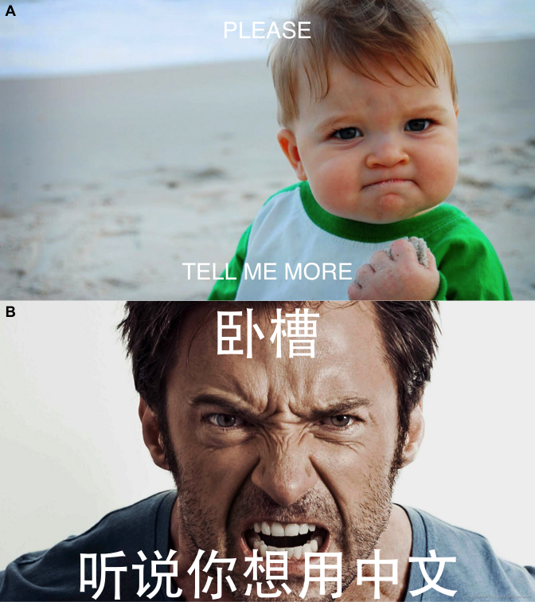

<!-- README.md is generated from README.Rmd. Please edit that file -->
`meme`
------

Call `meme` to add meme captions:

``` r
library(meme)
u <- "http://www.happyfamilyneeds.com/wp-content/uploads/2017/08/angry8.jpg"
meme(u, "code", "all the things!")
```


The grammar of meme :smile:
---------------------------

Not that useful, just to mimic `ggplot2`:

``` r
mmplot(u) + mm_caption("calm down", "and RTFM", color="purple")
```



`meme_save`: a meme version of `ggsave` :smiley:
------------------------------------------------

The `meme` output can be saved as an object, and can be exported to file using `meme_save`. `meme_save` helps user setting up the output figure aspect ratio and calls `ggsave` to export the figure:

``` r
u2 <- "http://i0.kym-cdn.com/entries/icons/mobile/000/000/745/success.jpg"
x <- meme(u2, "please", "tell me more")
meme_save(x, file="docs/Figs/meme.png")
```


`plot` method
-------------

Users can `plot` the `meme` output and change the caption or other parameters in real time.

``` r
plot(x, size = 2, "happy friday!", "wait, sorry, it's monday", color = "firebrick", font = "Courier")
```


`+` method
----------

Instead of using parameters in `plot()` explictely, Users can use `+ aes()` to set the plot parameters:

``` r
x + aes(upper = "#barbarplots",
        lower = "friends don't let friends make bar plots",
        color = firebrick, font = Courier, size=1.5)
```


or using `+ list()`. The following command will also generate the figure displayed above.

``` r
x + list(upper = "#barbarplots",
        lower = "friends don't let friends make bar plots",
        color = "firebrick", font = "Courier", size=1.5)
```

multi-language support
----------------------

I didn't do anything about it. Multi-language was supported internally. Just simply select a font for your language.

``` r
y <- meme(u, "卧槽", "听说你想用中文", font="STHeiti")
y
```


grid support
------------

``` r
library(grid)
mm <- meme(u, "code", "all the things!", size=.3, color='firebrick')

grid.newpage()
pushViewport(viewport(width=.9, height=.9))
grid.rect(gp = gpar(lty="dashed"))

xx <- seq(0, 2*pi , length.out=10)
yy <- sin(xx)

for (i in seq_along(xx)) {
    vp <- viewport(x = xx[i]/(2*pi), y = (yy[i]-min(yy))/2, width=.05, height=.05)
    print(mm, vp = vp)
}
```



ggplot2 support
---------------

``` r
library(ggplot2)
library(ggimage)

d <- data.frame(x = xx, y = yy)
ggplot(d, aes(x, y)) + geom_line() +
    geom_subview(mm, x = xx, y = yy, width=.3, height=.15)
```



``` r
ggplot(d, aes(x, y)) +
    geom_subview(mm+aes(size=3), x=0, y=0, width=Inf, height=Inf) +
    geom_point() + geom_line()
```


cowplot support
---------------

``` r
cowplot::plot_grid(x, y, ncol=1, labels = c("A", "B"))
```


