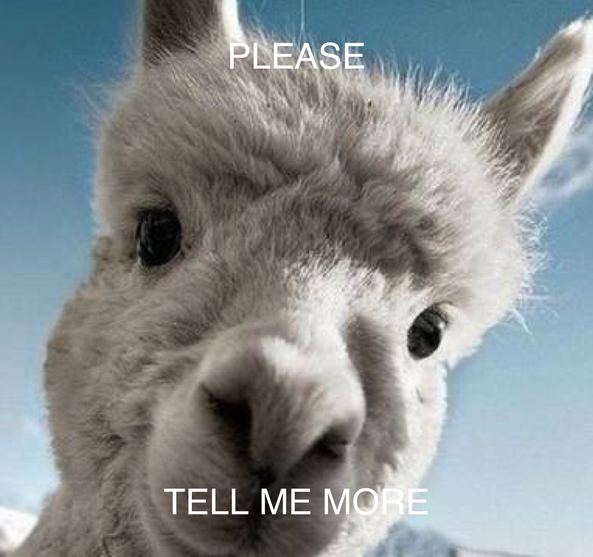

<!-- README.md is generated from README.Rmd. Please edit that file -->
Call \``meme` to add meme captions:

``` r
library(me2)
u <- "http://www.happyfamilyneeds.com/wp-content/uploads/2017/08/angry8.jpg"
meme(u, "code", "all the things!")
```


The `meme` output can be save as an object, and can be exported to file using `meme_save`:

``` r
u2 <- "http://i0.kym-cdn.com/entries/icons/mobile/000/000/745/success.jpg"
x <- meme(u2, "please", "tell me more", plot=FALSE)
x
meme_save(x, file="Figs/meme.png")
```



Users can `plot` the `meme` output and change the caption or other parameters in real time.

``` r
plot(x, size = 2, "happy friday!", "wait, sorry, it's monday", color = "firebrick", font = "Courier")
```


``` r
meme(u, "卧槽", "听说你想用中文", font="STHeiti")
```


